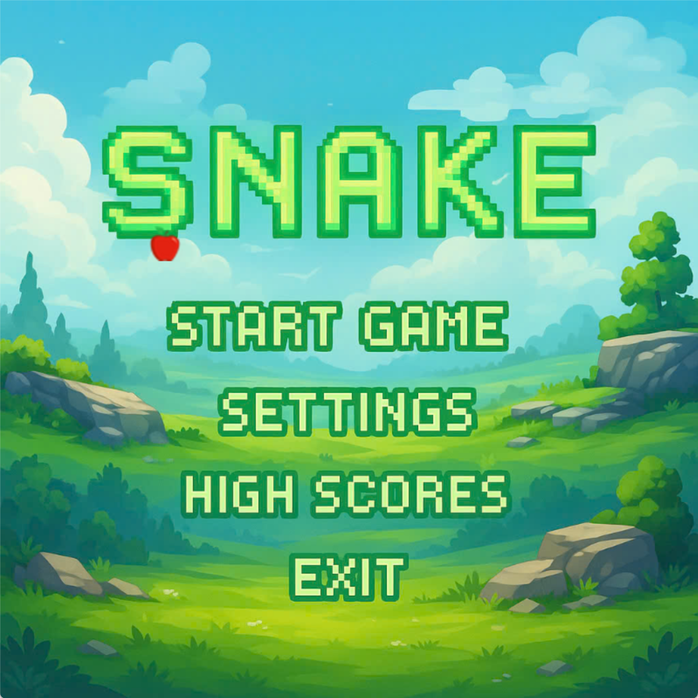
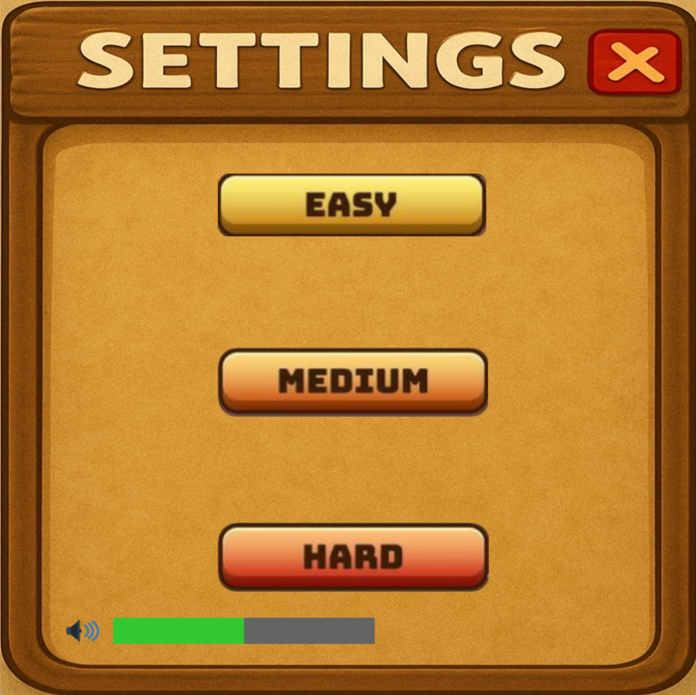
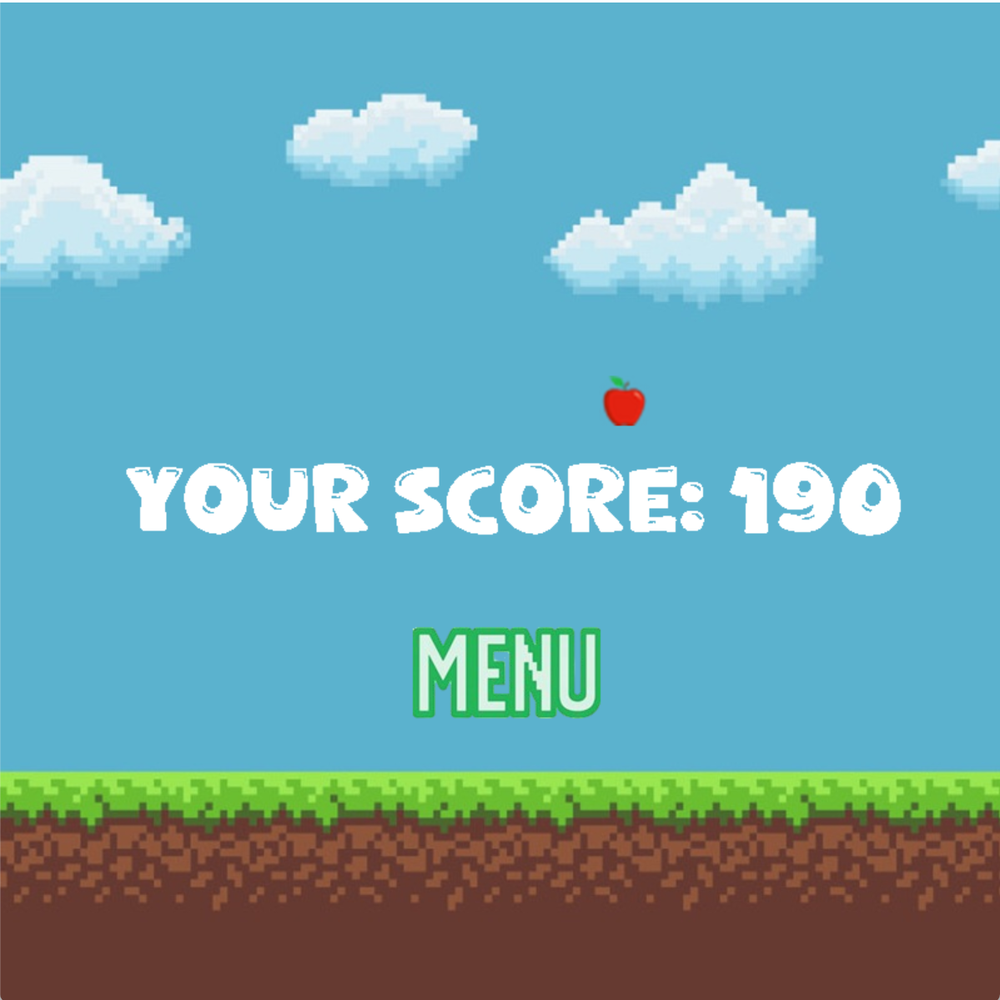
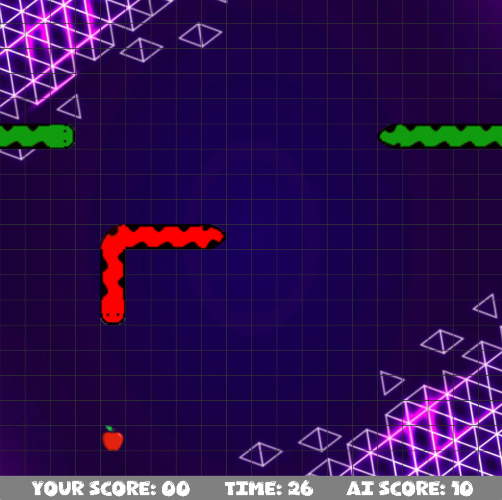

# **Snake**
## Introduction
- Họ và tên: Lương Minh Dương
- Mã sinh viên: 24021439
- Bài tập lớn: Snake
## Description
- Snake là một trò chơi cổ điển trong đó người chơi điều khiển một con rắn di chuyển trong không gian giới hạn để ăn mồi. Mỗi lần ăn được mồi, rắn sẽ dài ra và điểm số sẽ được cộng thêm. Mục tiêu là đạt điểm cao nhất có thể mà không để rắn đâm vào tường hoặc chính thân mình.
- Game có 3 chế độ chơi:
  - Chế độ dễ: Người chơi sẽ điều khiển rắn để ăn quả và sẽ thua nếu cắn vào đuôi của mình. Rắn có thể đi xuyên tường.
  - Chế độ trung: Tương tự như chế độ cổ điển nhưng sẽ thua khi rắn chạm tường.
  - Chế độ khó: Người chơi sẽ được trải nghiệm 1 chế độ chơi mới hoàn toàn, đó là thử sức với 1 chú rắn AI thông minh và tìm táo rất nhanh. Sau 30s, ai là người nhiều điểm hơn sẽ giành chiến thắng, và khi cắn vào đuôi chính mình sẽ thua ngay lập tức, còn cắn vào rắn của đối phương sẽ không sao.
- Game có các âm thanh nhẹ nhàng giúp người chơi thưu giãn trong quá trình chơi.
- Game có các chức năng xem kiểm cao nhất, chỉnh thanh âm lượng, chuyển giữa các chế độ, thoát game, ...
## Control
| Control | Play | 
| --------|------|
| UP      |  ↑   | 
| DOWN    |  ↓   |
| LEFT    |  ←  |
| RIGHT   |  →  |
## Preview
  
  
  
  

## Các kĩ thuật sử dụng
- Thư viện SDL_2
- Sử dụng nhiều class, vector, tách file, nạp chồng toán tử, ...
- Có thể lưu lại điểm cao nhất sau mỗi lần chơi nhờ đọc, ghi file
- Photoshop
## Nguồn tham khảo
- Link code tham khảo: [Nguồn code tham khảo](https://youtu.be/jdpBqzf-jNQ?si=npLzona-vqBKcf_t)
- Link ý tưởng và hình ảnh: [Nguồn ý tưởng](https://youtu.be/I_IGbPugyH0?si=U4J3iVu3rz80g8og)
- Âm thanh nền: [Nguồn âm thanh](https://youtu.be/GfYRemfx48Q?si=1Inszd2ALmfb_Tla)
- Tài liệu tham khảo về thư viện SDL_2: [Tài liệu tham khảo](https://docs.google.com/document/d/1FZ3jTqHxtyZznNWiJmmve0zYu_aSliUqLP2OsMcdehQ/edit?tab=t.0)
- ChatGPT
